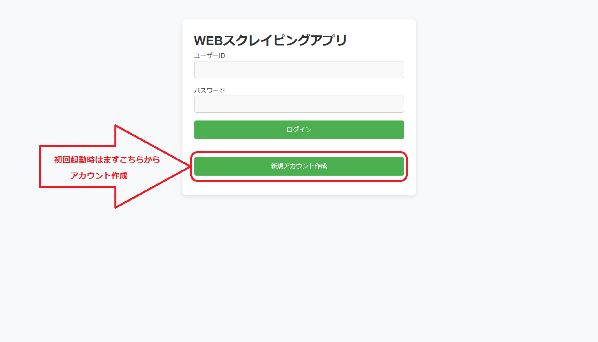
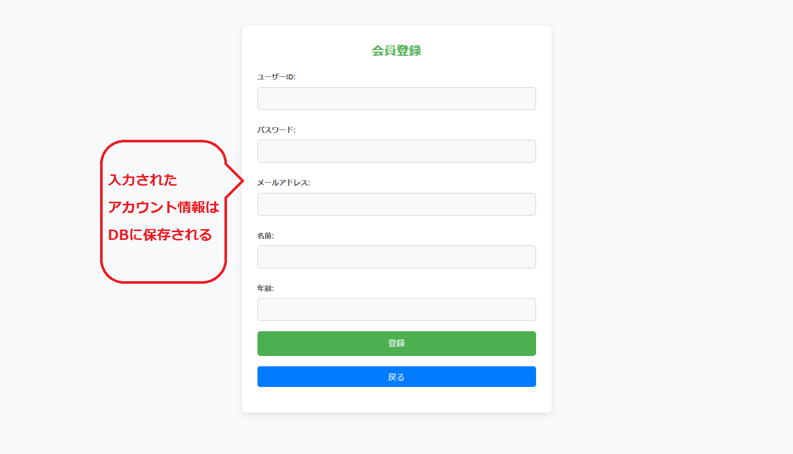
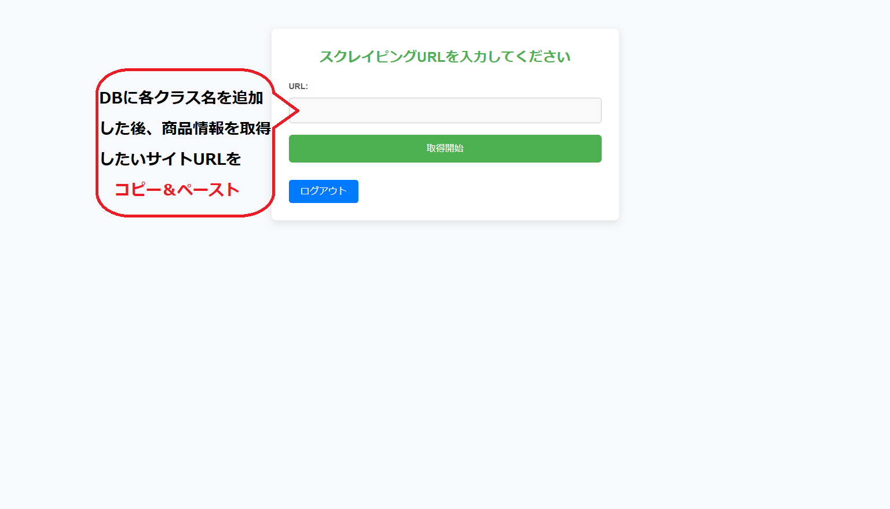
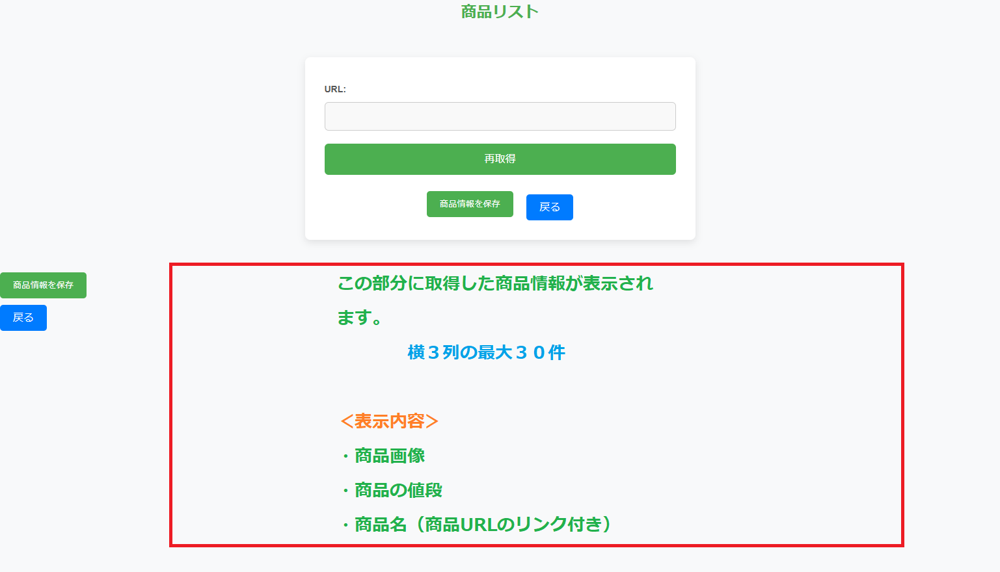

# プロジェクト名　　webscrapingアプリ

## 項目

1. [プロジェクトについて](#プロジェクトについて)
2. [動作環境](#環境)
3. [デモ画面](#デモ画面)
4. [実行準備](#実行準備)

<!-- プロジェクトについて -->

## プロジェクトについて
授業の一環としてWebアプリケーションを作成しました。  

・ターゲットユーザー  
　　ショップで検索した商品情報を取得して、別々のショップ同士での価格の比較を行いたい方　 
・アプリ導入による効果  
　　価格比較したいショップをピンポイントに選択できる　 
・所感  
　　アプリの機能自体は想像通りのものを実装できましたが、最終的には、保存した商品情報をブラウザ上に表示、価格順などの並び変え等の機能を実装する予定でしたが、時間が足りなく見送りました。  

(<a href="#top">トップへ</a>)

## 環境
<!-- シールド一覧 -->

  <!-- バックエンドの言語一覧 -->
  

<!-- 言語、フレームワーク、ミドルウェア、インフラの一覧とバージョンを記載 -->
- バックエンド
    - java
    - H2 Database
    - Apache Tomcat (Tomcat9_Java17)
- フロントエンド
    - HTML
    - CSS
    - javascript
    

(<a href="#top">トップへ</a>)

## デモ画面
 
【トップ画面】スタート画面です。 

 
【登録画面】会員登録の画面です。 

 
【入力画面】サイトURLの入力画面です。 

 
【結果画面】サイトURL情報取得の結果画面です。  

(<a href="#top">トップへ</a>)

## 実行準備
0.　　※必ず利用前にreadme.txtをご確認ください。

1.　　.Githubからリポジトリをクローン  

2.　　Eclipseに「webscraping」をインポート  

3_1.　SQLフォルダをデスクトップ上に配置し、中の「ITWorkshop_test.mv.db」の名前を「ITWorkshop.mv.db」に変更する 
3_2.　H2 Databaseで「ITWorkshop.mv.db」を読み込み  
3_3.　readme.txtに従い取得するサイトの情報を追加する 

4.　　Tomcat9_Java17で「servlet/Main.java」を実行  

補足.　/webscraping/src/main/webapp/videoフォルダ内に任意のMP4動画「background.mp4」を配置することで背景を変更できる

(<a href="#top">トップへ</a>)
